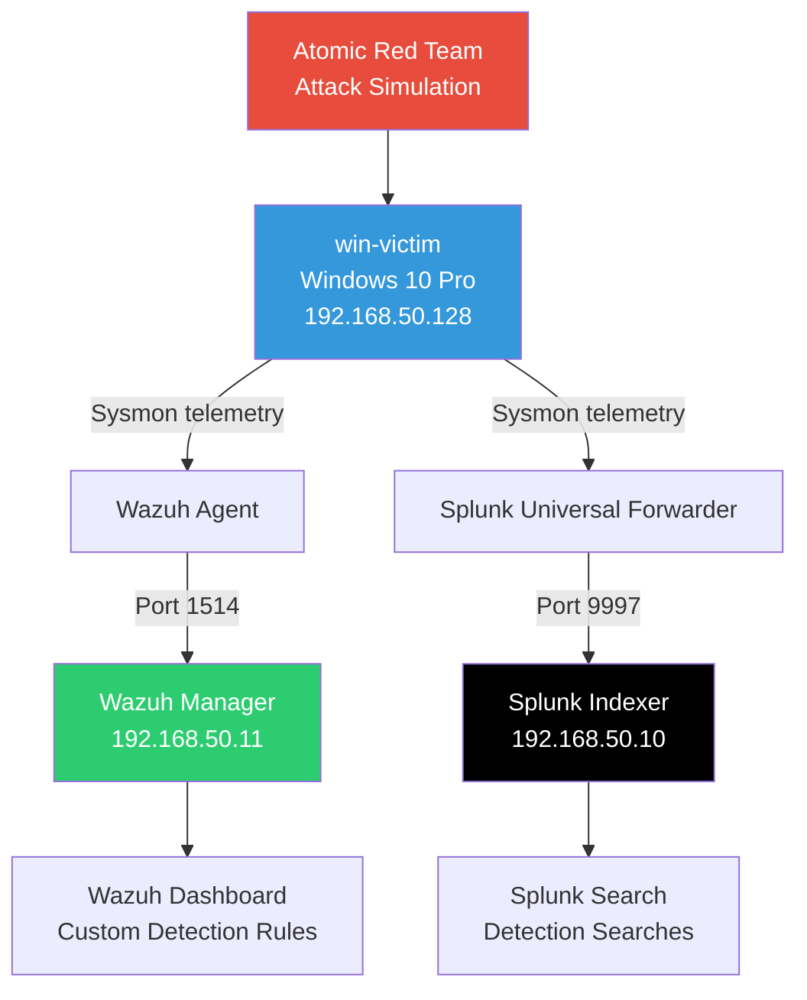
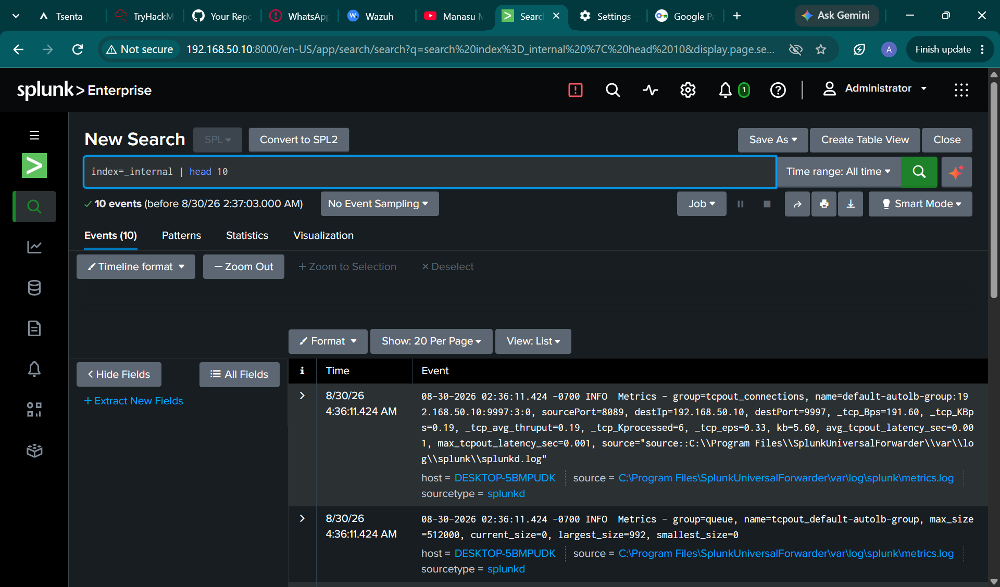
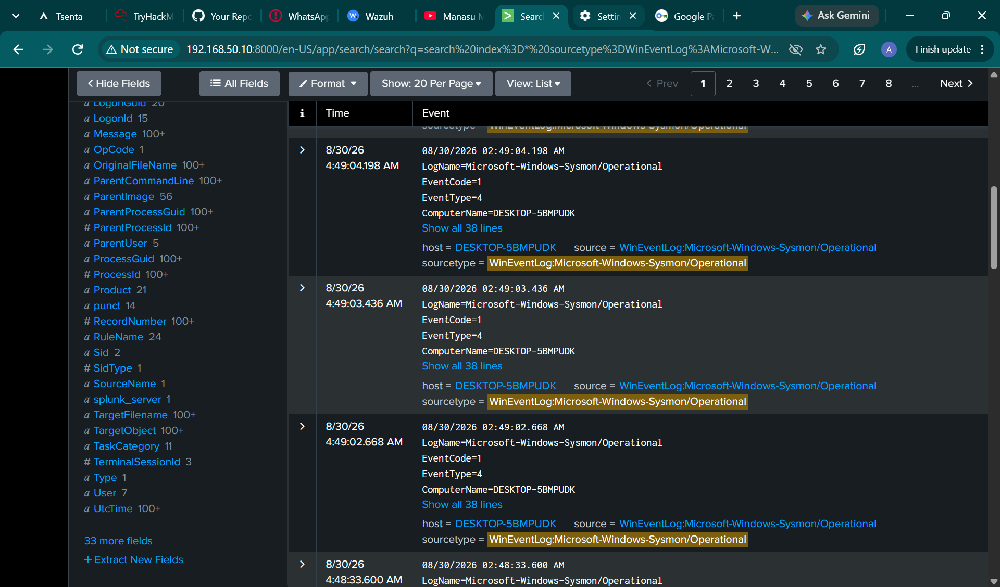
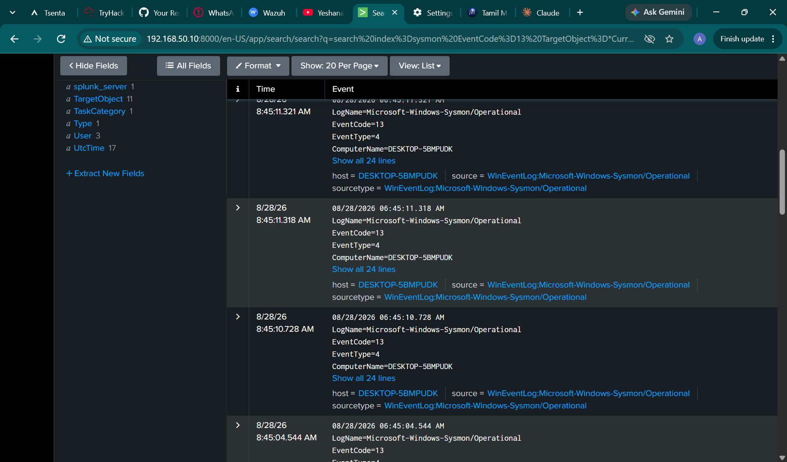
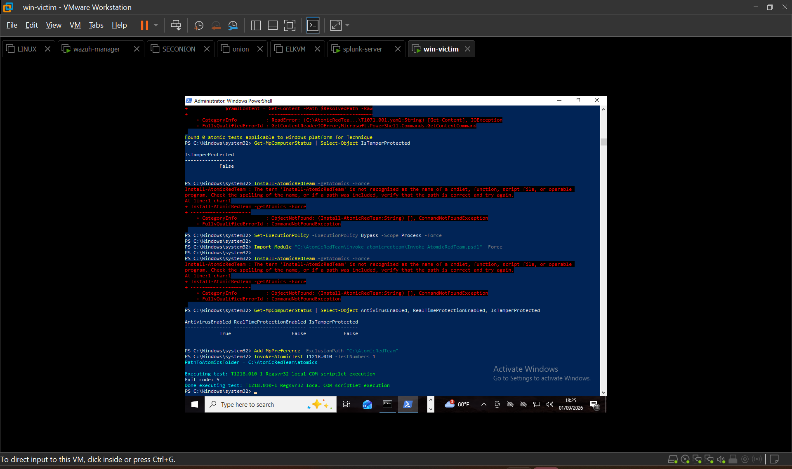
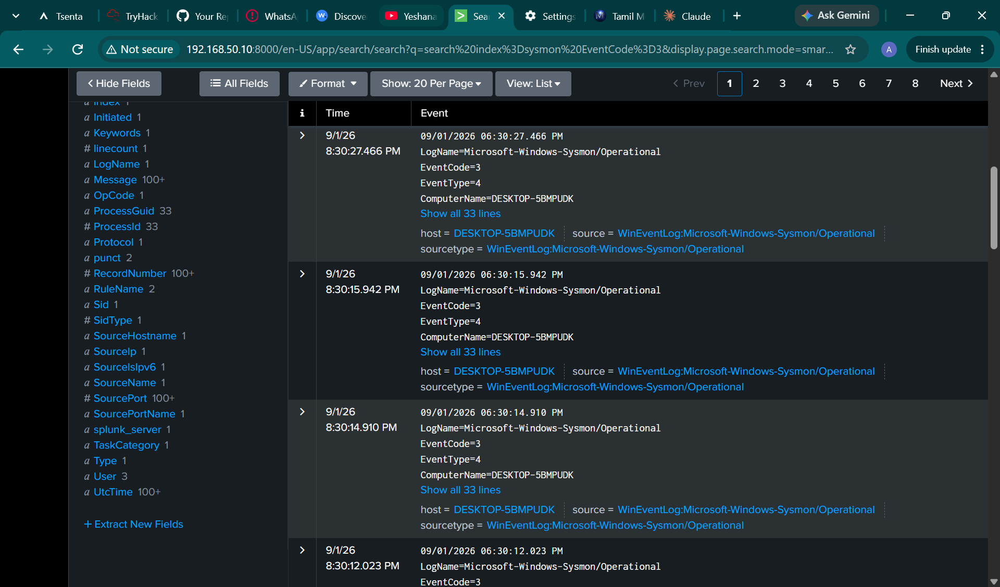

## Endpoint Threat Detection Lab — Sysmon + Wazuh + Splunk


## Table of Contents

- [Overview](#overview)
- [Demo](#demo)
- [Architecture](#architecture)
- [Repository Structure](#repository-structure)
- [Prerequisites](#prerequisites)
- [What I Did](#what-i-did)
- [Skills Demonstrated](#skills-demonstrated)
- [Detection Rules](#detection-rules)
- [Attack Simulation Results](#attack-simulation-results)
- [Key Findings](#key-findings)
- [Screenshots](#screenshots)
- [Challenges & Lessons Learned](#challenges--lessons-learned)
- [Future Improvements](#future-improvements)
- [Tools Used](#tools-used)
- [References](#references)

## Overview

A three-tier home-lab SOC environment built to practice endpoint detection engineering end-to-end: instrumenting a Windows victim host with Sysmon, forwarding telemetry into two independent detection stacks (Wazuh and Splunk), writing custom detection rules, and validating them against real MITRE ATT&CK-mapped attack simulations using Atomic Red Team.

The goal was not just to stand up the tools, but to prove detection coverage by actually attacking the endpoint and confirming the alerts fire — including documenting the cases where they don't (Windows Defender intercepting two techniques before the SIEM layer ever saw them).

## Demo

*Demo GIF coming soon — will show an alert firing live in Wazuh and Splunk.*

## Architecture



Three VMware Workstation VMs on an isolated host-only network (`VMnet2`, subnet `192.168.50.0/24`), with internet egress via a gateway for tooling and updates.

| VM | OS | IP | Role |
|---|---|---|---|
| `win-victim` | Windows 10 Pro | `192.168.50.128` | Instrumented endpoint — Sysmon, Wazuh agent, Splunk Universal Forwarder |
| `wazuh-manager` | Ubuntu 24.04 | `192.168.50.11` | Wazuh manager, indexer, dashboard |
| `splunk-server` | Ubuntu 24.04 | `192.168.50.10` | Splunk Enterprise indexer + search head |

> The Wazuh agent registers under the actual Windows hostname `DESKTOP-5BMPUDK`, not the VM label `win-victim` — both refer to the same host.

## Repository Structure

```
endpoint-detection-lab/
├── docs/              # Detailed write-ups (attack simulation log, etc.)
├── screenshots/        # Evidence organized by stage/technique
├── splunk-searches/     # Detection SPL queries
├── wazuh-rules/        # Custom Wazuh detection rules (local_rules.xml)
├── LICENSE
└── README.md
```

## Prerequisites

To rebuild this lab, you'll need:

- VMware Workstation (or another hypervisor capable of host-only networking)
- A Windows 10 Pro ISO for the victim endpoint
- Ubuntu Server 24.04 ISOs for the Wazuh manager and Splunk server VMs
- [Sysmon](https://learn.microsoft.com/en-us/sysinternals/downloads/sysmon) with the [SwiftOnSecurity config](https://github.com/SwiftOnSecurity/sysmon-config)
- Wazuh 4.9.0 (manager + agent)
- Splunk Enterprise and a Splunk Universal Forwarder license/install
- [Atomic Red Team](https://github.com/redcanaryco/atomic-red-team) for attack simulation

## What I Did

- Deployed Sysmon on the victim endpoint using the SwiftOnSecurity configuration for high-fidelity process, network, and registry telemetry
- Stood up Wazuh manager, indexer, and dashboard on a dedicated Ubuntu VM; connected and validated a Windows agent
- Wrote custom Wazuh detection rules (`wazuh-rules/local_rules.xml`) mapped to specific MITRE ATT&CK techniques: encoded PowerShell execution, LSASS memory access, and registry-based persistence
- Deployed Splunk Enterprise as a second, fully independent detection pipeline, running as a non-root service account
- Configured Splunk Universal Forwarder to monitor the Sysmon event log channel and forward to the indexer
- Diagnosed and resolved a subtle forwarding failure where data appeared to be transmitted (open TCP port, active metrics) but never indexed — root-caused to a Windows Access Denied error on the event log subscription
- Simulated five MITRE ATT&CK techniques using Atomic Red Team and independently validated detections in both Wazuh and Splunk
- Documented two techniques that were blocked by Windows Defender's signature detection before ever reaching the SIEM layer — a legitimate defense-in-depth finding, not a gap in the lab

## Skills Demonstrated

Windows and Linux system administration, SIEM deployment and tuning (Wazuh + Splunk), Sysmon telemetry engineering, custom detection rule writing (XML/regex, MITRE ATT&CK mapping), Splunk SPL query authoring, adversary emulation with Atomic Red Team, network troubleshooting (TCP forwarding, Windows event log permissions, clock synchronization), and systematic root-cause debugging under ambiguous symptoms.

## Detection Rules

Custom detection logic lives in two places, one per stack:

- **`wazuh-rules/local_rules.xml`** — custom Wazuh rules mapped to MITRE ATT&CK techniques (encoded PowerShell execution, LSASS memory access, registry-based persistence)
- **`splunk-searches/`** — SPL detection searches covering the same technique set, run against Sysmon-sourced indexes

Both stacks were built and tuned independently so that a detection gap in one wouldn't be masked by the other — see [Attack Simulation Results](#attack-simulation-results) for how each rule set performed against live technique execution.

## Attack Simulation Results

| # | Technique | Test | Result | Detected In |
|---|---|---|---|---|
| 1 | T1059.001 — PowerShell (Encoded Command) | Manual base64 `-EncodedCommand` execution | Success | Splunk + Wazuh |
| 2 | T1547.001 — Registry Run Key Persistence | Atomic Test #1 | Success, exit code 0 | Splunk + Wazuh |
| 3 | T1218.010 — Regsvr32 (LOLBin) | Atomic Test #1 | Blocked by Windows Defender pre-execution | N/A |
| 4 | T1003.001 — LSASS Memory (Mimikatz) | Atomic Test #1 | Blocked by Windows Defender pre-execution | N/A |
| 5 | T1071.001 — Malicious User Agent / C2-style traffic | Atomic Test #1 | Success, exit code 0 | Splunk + Wazuh |

Full write-up with timestamps and raw evidence: [docs/attack-simulation-log.md](docs/attack-simulation-log.md)

## Key Findings

Three of five simulated techniques executed successfully and were independently confirmed in both detection stacks, validating the full telemetry pipeline from Sysmon through two separate forwarding mechanisms into two separate SIEMs. The remaining two techniques (Mimikatz-based credential dumping and a Regsvr32 COM-scriptlet LOLBin) were intercepted by Windows Defender's real-time signature detection before Sysmon or either SIEM observed any activity — confirmed via `Get-MpThreatDetection`, which showed genuine malware classifications (`Trojan:Win64/Phave.MK`, `HackTool:Win32/PortMon!AMTB`) against the downloaded atomics payloads.

This is a meaningful result on its own: it demonstrates defense-in-depth, where endpoint AV catches known-malicious tooling upstream of the SIEM layer entirely. It also identifies a real blind spot — if Defender were ever disabled, misconfigured, or bypassed (a common real-world adversary TTP), detection for those two techniques would depend entirely on the Sysmon/Wazuh/Splunk layer, which was never actually exercised in this run.

## Screenshots

**Troubleshooting the Splunk forwarding failure** — full arc from an apparently-successful TCP connection through root cause to fix:


*Access Denied (errorCode=5) on the Sysmon WinEventLog subscription — the actual root cause, despite the forwarder showing an active TCP connection*


*14,405 Sysmon events successfully indexed after switching the forwarder service to LocalSystem*

**Technique detections:**


*Registry Run key persistence test detected in Splunk*


*Windows Defender threat detection log showing real malware classifications against Atomic Red Team payloads*


*Suspicious outbound connection activity captured in Splunk*

Full set of screenshots organized by stage: [screenshots/](screenshots/)

## Challenges & Lessons Learned

- **A healthy-looking TCP connection is not proof of a working pipeline.** The Splunk forwarder showed a stable, repeatedly-reconnecting TCP session to the indexer with active throughput in `metrics.log`, yet zero events landed in any index. The actual failure was one layer up — the forwarder's `WinEventLog` modular input was failing to subscribe to the Sysmon channel with a Windows Access Denied error, because Sysmon's event log channel requires explicit read permissions that the forwarder's default service account didn't have.
- **Agent naming assumptions can waste real debugging time.** Wazuh registers agents by Windows hostname, not by any label used elsewhere (like a VM name in VMware Workstation). Searching for the "wrong" name looked identical to the agent being disconnected.
- **Clock drift silently hides data.** Indexed events with correct data can be invisible under default relative search windows if the collecting host's clock has drifted from the indexer's clock — worth checking "All time" before assuming a pipeline is broken.
- **PowerShell session state is not persistent.** Execution policy bypasses and imported modules apply only to the session they were set in; every new terminal window requires re-running setup before Atomic Red Team commands work.
- **Attack simulation frameworks will get flagged by AV, and that's expected.** Rather than disabling endpoint protection to force every technique to execute, leaving two techniques as "blocked by Defender" and documenting why is a more honest and more useful result.

## Future Improvements

- Extend `local_rules.xml` with dedicated custom rules for LOLBins (T1218) and suspicious outbound connections (T1071), currently relying on Wazuh's default ruleset for those categories
- Add a scheduled/automated Atomic Red Team test runner instead of manual per-technique execution
- Build a Splunk dashboard visualizing detections across all five techniques on one pane
- Extend coverage to lateral movement and exfiltration techniques
- Script the full environment build (Vagrant/Ansible) for one-command lab reset

## Tools Used

Sysmon (SwiftOnSecurity config), Wazuh 4.9.0, Splunk Enterprise, Splunk Universal Forwarder, Atomic Red Team, VMware Workstation, Windows 10 Pro, Ubuntu Server 24.04, PowerShell

## References

- [MITRE ATT&CK](https://attack.mitre.org/)
- [Atomic Red Team](https://github.com/redcanaryco/atomic-red-team)
- [Sysmon (SwiftOnSecurity config)](https://github.com/SwiftOnSecurity/sysmon-config)
- [Wazuh Documentation](https://documentation.wazuh.com/)
- [Splunk Documentation](https://docs.splunk.com/)
